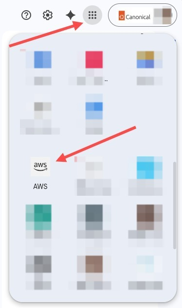
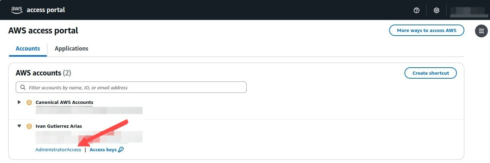
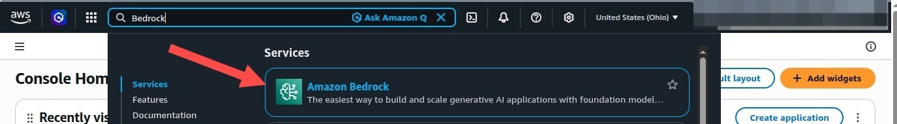
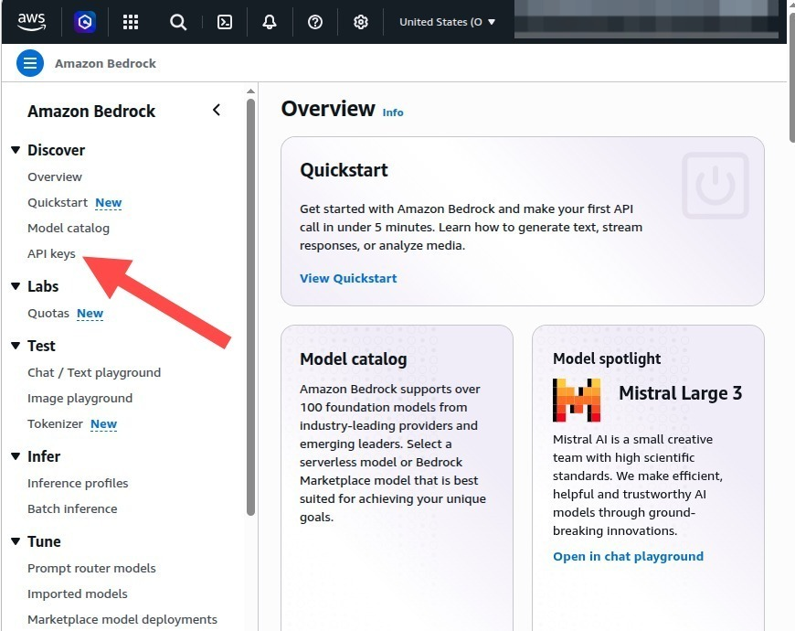
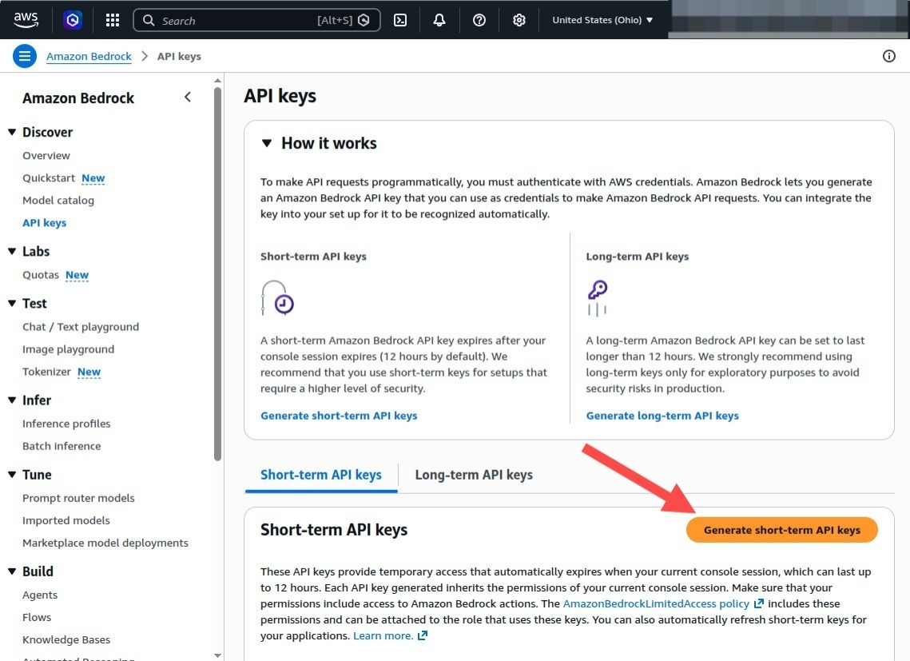
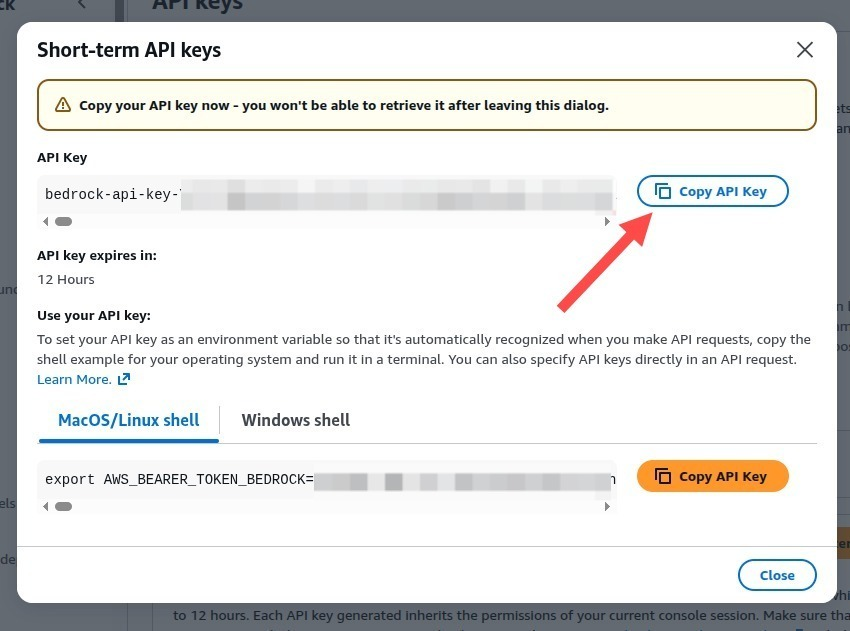

## Rag Snap Bedrock Guide

1. Access your AWS account from your **Google Drive - Google apps** (in the top right corner) and scroll down to **AWS** 

2. On the AWS access portal, use your **AdministratorAccess** in your <your.name>@canonical.com account. 

3. Search for **Amazon Bedrock** 

4. Once in the Amazon Bedrock landing page, click on **[View API keys]** or **[Discover >
API keys]** in: 

5. Now you can click on **[Generate short-term API keys]**. In case you decide to use long-term keys, please be aware of the security implications.

6. Copy your **API key**

7. Set the **snap configuration** and **environment variable** with your API key:

`sudo rag set --package chat.http.host="bedrock-runtime.us-east-2.amazonaws.com"`\
`sudo rag set --package chat.http.port="443"`\
`sudo rag set --package chat.http.tls="true"`\
`sudo rag set --package chat.http.path="openai/v1"`\
`export CHAT_API_KEY="bedrock-api-key-YmVkcm9jay5hbWF6b25hd3MuY29tLY..."`

Note: ensure the API key was generated in the **same AWS region** from your chat.http.host

8. Select a Bedrock OpenAl-compatible model, for example:

`rag chat mistral.mistral-large-3-675b-instruct`
